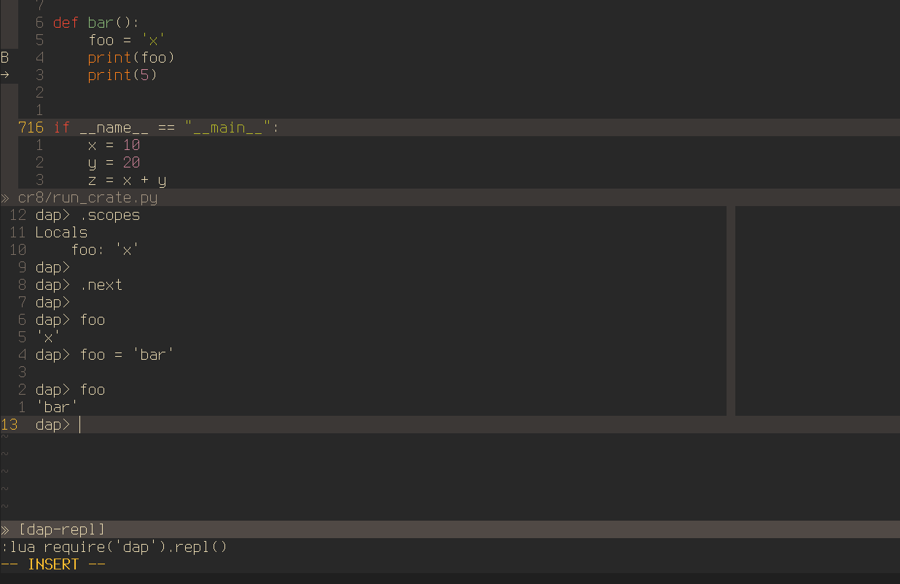

# DAP (Debug Adapter Protocol)

`nvim-dap` is a Debug Adapter Protocol client implementation for [Neovim][1] (>= 0.5)

**Warning**: This is in an early stage. It targets Neovim HEAD and therefore
things may break.

## Features

- [x] launch debug adapter
- [x] attach to debug adapter
- [x] toggle breakpoints
- [x] breakpoints with conditions
- [x] logpoints
- [ ] set function breakpoints
- [x] set exception breakpoints
- [x] step over, step into, step out
- [x] step back, reverse continue
- [x] Goto
- [x] restart
- [x] stop
- [x] pause
- [x] evaluate expressions
- [x] REPL (incl. commands to show threads, frames and scopes)

## Extensions

- [nvim-dap-virtual-text][7] - Inlines the values for variables as virtual text
  using treesitter.

## Goals

The goal of nvim-dap is to provide a basic debugger for Neovim to be used with
Debug Adapters implementing the Debug Adapter Protocol.

Another goal is for nvim-dap to be usable as a client library for DAP to be
used by other plugins. Other plugins should be able to either extend the UI
(like [nvim-dap-virtual-text][7]), or to build configuration discovery
functionality. For example [nvim-jdtls][8] integrates with nvim-dap, it
dynamically adds debug configurations and contains functionality that allows
users to debug individual test cases.

## Non-Goals

- Debug adapter installations are out of scope. It's not the business of an
  editor plugin to re-invent a package manager. Use your system package
  manager. Use Nix. Use Ansible.

- Vim support. It's not going to happen. Use [vimspector][2] instead.

## Alternatives

- [vimspector][2]

## Installation

- Requires [Neovim HEAD/nightly][6]
- nvim-dap is a plugin. Install it like any other Vim plugin.
- Call `:packadd nvim-dap` if you install `nvim-dap` to `'packpath'`.

## Usage

See [:help dap](doc/dap.txt) and the [Debug-Adapter Installation][5] wiki.
Keep in mind that the APIs are subject to change.

[1]: https://neovim.io/
[2]: https://github.com/puremourning/vimspector
[3]: https://github.com/neovim/nvim-lsp
[4]: https://github.com/microsoft/debugpy
[5]: https://github.com/mfussenegger/nvim-dap/wiki/Debug-Adapter-installation
[6]: https://github.com/neovim/neovim/releases/tag/nightly
[7]: https://github.com/theHamsta/nvim-dap-virtual-text
[8]: https://github.com/mfussenegger/nvim-jdtls
